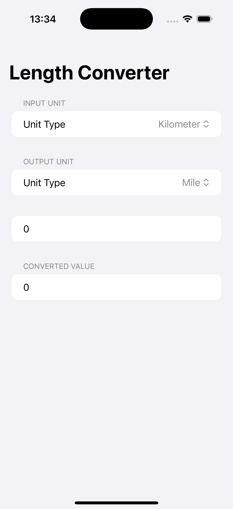
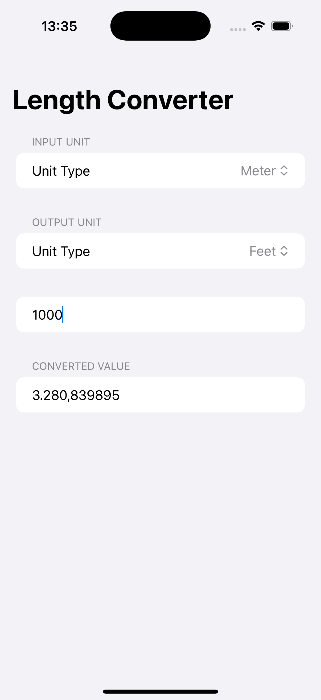

# Challenge1UnitConversion - Length Unit Converter

A SwiftUI application that converts between different length units including kilometers, meters, feet, yards, and miles. Features real-time conversion with a clean, form-based interface.

## Screenshots

    
    

## Features

- **Multiple Units**: Convert between 5 different length units
- **Real-time Conversion**: Instant conversion as you type
- **Clean Interface**: Form-based design with organized sections
- **Decimal Input**: Support for decimal numbers with number pad
- **Unit Selection**: Easy picker-based unit selection
- **Accurate Calculations**: Precise conversion formulas

## How It Works

1. **Select Input Unit**: Choose the unit you want to convert from
2. **Select Output Unit**: Choose the unit you want to convert to
3. **Enter Value**: Type the value you want to convert
4. **View Result**: See the converted value instantly
5. **Change Units**: Switch between any of the 5 supported units

## Supported Units

- **Kilometer** (km)
- **Meter** (m)
- **Feet** (ft)
- **Yard** (yd)
- **Mile** (mi)

## Technical Details

- **Platform**: iOS 17.0+
- **Language**: Swift
- **Framework**: SwiftUI
- **Architecture**: Simple state management with computed properties
- **Key Concepts**: @State, computed properties, Form, Picker, TextField
- **Target**: iPhone (Portrait orientation)

## Setup Instructions

1. Open `Challenge1UnitConversion.xcodeproj` in Xcode
2. Select your target device or simulator
3. Build and run the project (⌘+R)
4. Start converting units!

## Requirements

- Xcode 15.0 or later
- iOS 17.0 or later
- Swift 5.9 or later

## About

This project is part of the "100 Days of SwiftUI" challenge. It demonstrates:

- **Form Design**: Creating organized forms with sections
- **Picker Components**: Using pickers for unit selection
- **Computed Properties**: Real-time calculation of converted values
- **State Management**: Managing multiple @State variables
- **User Input**: Handling numeric input with proper keyboard types

## Author

Created by Ahmet Büyükçelik as part of 100 Days of SwiftUI learning journey.

---

*Convert lengths with precision! 📏🔄*
