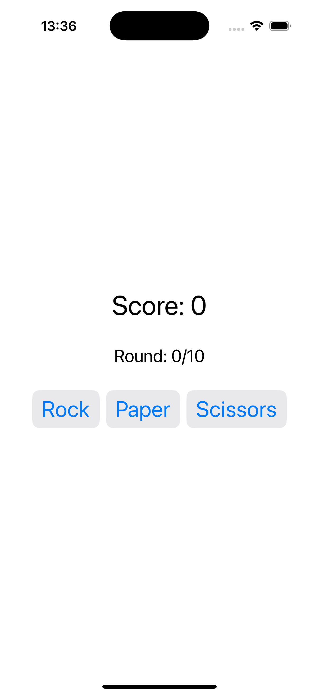
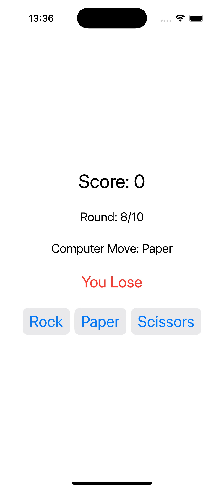

# Challenge2RockPaperScissors - Strategic Rock Paper Scissors

A SwiftUI implementation of the classic Rock Paper Scissors game with a strategic twist. Players must choose the correct move to win against the computer's predetermined choice, testing both strategy and quick thinking.

## Screenshots

    
    
    

## Features

- **Strategic Gameplay**: Choose the right move to win or lose as instructed
- **Score Tracking**: Keep track of your performance across 10 rounds
- **Round Counter**: Visual progress indicator for the current game
- **Win/Lose Logic**: Clear feedback on whether you made the correct choice
- **Game Reset**: Start a new game after completing 10 rounds
- **Random Challenges**: Each round randomly determines if you should win or lose

## How It Works

1. **Read the Challenge**: The game tells you whether you should win or lose
2. **Choose Your Move**: Select Rock, Paper, or Scissors
3. **See the Result**: View the computer's move and whether you succeeded
4. **Track Progress**: Monitor your score and round progress
5. **Complete 10 Rounds**: Finish the game and see your final score
6. **Reset and Play Again**: Start a new game to improve your score

## Game Rules

- **Rock** beats **Scissors**
- **Paper** beats **Rock**  
- **Scissors** beats **Paper**
- Each round you're told whether you should win or lose
- Choose the correct move to score points
- Wrong choices result in point deduction

## Technical Details

- **Platform**: iOS 17.0+
- **Language**: Swift
- **Framework**: SwiftUI
- **Architecture**: State management with game logic
- **Key Concepts**: @State, game logic, conditional rendering, button interactions
- **Target**: iPhone (Portrait orientation)

## Setup Instructions

1. Open `Challenge2RockPaperScissors.xcodeproj` in Xcode
2. Select your target device or simulator
3. Build and run the project (⌘+R)
4. Start playing Rock Paper Scissors!

## Requirements

- Xcode 15.0 or later
- iOS 17.0 or later
- Swift 5.9 or later

## About

This project is part of the "100 Days of SwiftUI" challenge. It demonstrates:

- **Game Logic**: Implementing win/lose conditions and scoring
- **State Management**: Managing multiple game states and counters
- **Conditional UI**: Showing different content based on game state
- **User Interaction**: Button handling and game flow control
- **Random Elements**: Using random values for game variety

## Author

Created by Ahmet Büyükçelik as part of 100 Days of SwiftUI learning journey.

---

*Think strategically and win! 🪨📄✂️*
