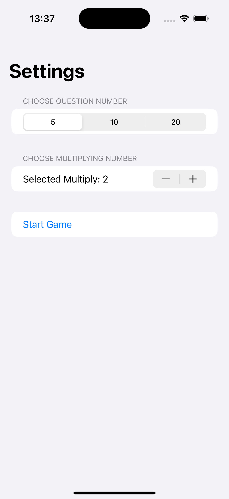
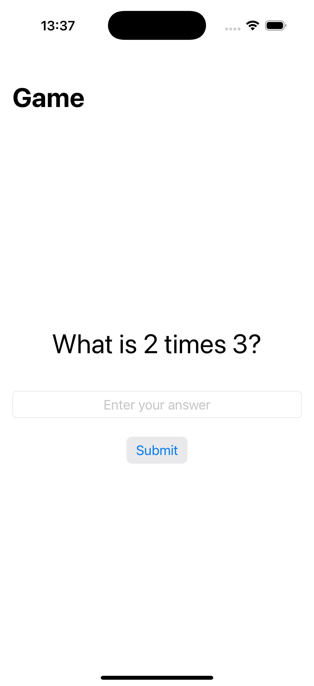
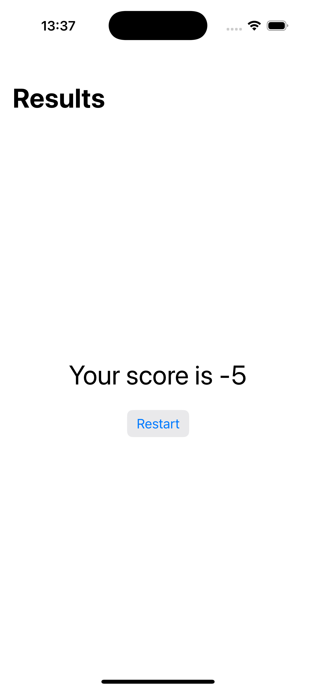

# Challenge3Edutainment - Multiplication Quiz Game

An educational SwiftUI application that creates a fun multiplication quiz game. Players can customize the number of questions and choose which multiplication table to practice, making learning math engaging and interactive.

## Screenshots

    
    
    

## Features

- **Customizable Quiz**: Choose number of questions (5, 10, or 20)
- **Multiplication Tables**: Practice any table from 2 to 12
- **Random Questions**: Each question uses a random multiplier
- **Score Tracking**: Keep track of correct and incorrect answers
- **Three Game States**: Settings, playing, and results screens
- **Educational Focus**: Makes learning multiplication fun and interactive

## How It Works

1. **Configure Settings**: Choose number of questions and multiplication table
2. **Start Game**: Generate random multiplication questions
3. **Answer Questions**: Type your answers using the number pad
4. **Track Progress**: See your score as you progress through questions
5. **View Results**: See your final score at the end
6. **Play Again**: Restart with new settings or same configuration

## Game Configuration

- **Question Count**: 5, 10, or 20 questions per game
- **Multiplication Table**: Choose any number from 2 to 12
- **Random Multipliers**: Each question uses a random number (2-12)
- **Scoring**: +1 for correct answers, -1 for incorrect answers

## Technical Details

- **Platform**: iOS 17.0+
- **Language**: Swift
- **Framework**: SwiftUI
- **Architecture**: State management with multiple game states
- **Key Concepts**: @State, enums, custom structs, navigation, forms
- **Target**: iPhone (Portrait orientation)

## Setup Instructions

1. Open `Challenge3Edutainment.xcodeproj` in Xcode
2. Select your target device or simulator
3. Build and run the project (⌘+R)
4. Start practicing multiplication!

## Requirements

- Xcode 15.0 or later
- iOS 17.0 or later
- Swift 5.9 or later

## About

This project is part of the "100 Days of SwiftUI" challenge. It demonstrates:

- **State Management**: Managing complex game states with enums
- **Custom Data Types**: Creating Question structs for game data
- **Form Design**: Building settings screens with pickers and steppers
- **Navigation**: Moving between different game screens
- **User Input**: Handling numeric input and validation
- **Educational App Design**: Creating engaging learning experiences

## Author

Created by Ahmet Büyükçelik as part of 100 Days of SwiftUI learning journey.

---

*Learn multiplication while having fun! 🧮📚*
