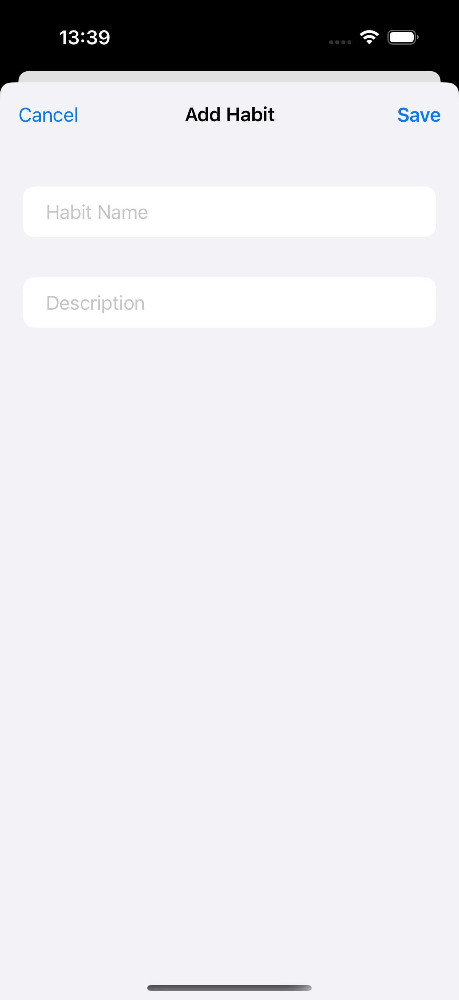
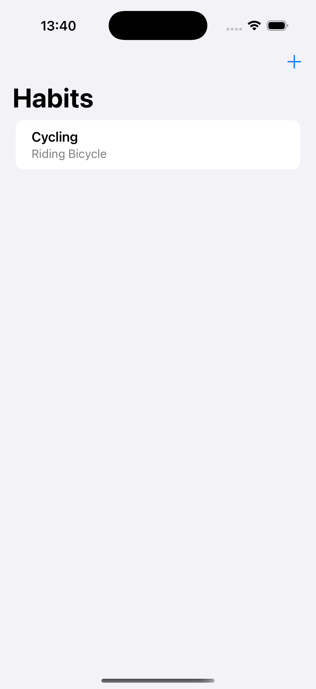

# Challenge4HabitTracking - Personal Habit Tracker

A SwiftUI application for tracking personal habits and activities. Users can add, view, and manage their daily habits with a clean, intuitive interface that helps build positive routines.

## Screenshots

    
    

## Features

- **Habit Management**: Add, view, and delete personal habits
- **Detailed Descriptions**: Each habit can have a custom description
- **Clean Interface**: Simple list-based design for easy navigation
- **Add New Habits**: Sheet-based form for adding new activities
- **Swipe to Delete**: Easy habit removal with swipe gestures
- **Observable Data**: Real-time updates using @Observable pattern

## How It Works

1. **View Habits**: See all your tracked habits in a clean list
2. **Add New Habit**: Tap the + button to add a new habit
3. **Enter Details**: Provide habit name and description
4. **Save Habit**: Add the habit to your tracking list
5. **Manage Habits**: Swipe left to delete unwanted habits
6. **Track Progress**: Monitor your habits over time

## Technical Details

- **Platform**: iOS 17.0+
- **Language**: Swift
- **Framework**: SwiftUI
- **Architecture**: MVVM with @Observable pattern
- **Key Concepts**: @Observable, sheets, list management, custom data types
- **Target**: iPhone (Portrait orientation)

## Setup Instructions

1. Open `Challenge4HabitTracking.xcodeproj` in Xcode
2. Select your target device or simulator
3. Build and run the project (⌘+R)
4. Start tracking your habits!

## Requirements

- Xcode 15.0 or later
- iOS 17.0 or later
- Swift 5.9 or later

## About

This project is part of the "100 Days of SwiftUI" challenge. It demonstrates:

- **@Observable Pattern**: Modern state management in SwiftUI
- **Custom Data Types**: Creating Activity and Activities classes
- **Sheet Presentations**: Modal forms for adding new content
- **List Management**: Adding, displaying, and deleting list items
- **Navigation**: Toolbar items and navigation patterns
- **User Experience**: Intuitive habit tracking interface

## Author

Created by Ahmet Büyükçelik as part of 100 Days of SwiftUI learning journey.

---

*Build better habits, one day at a time! 📝✅*
