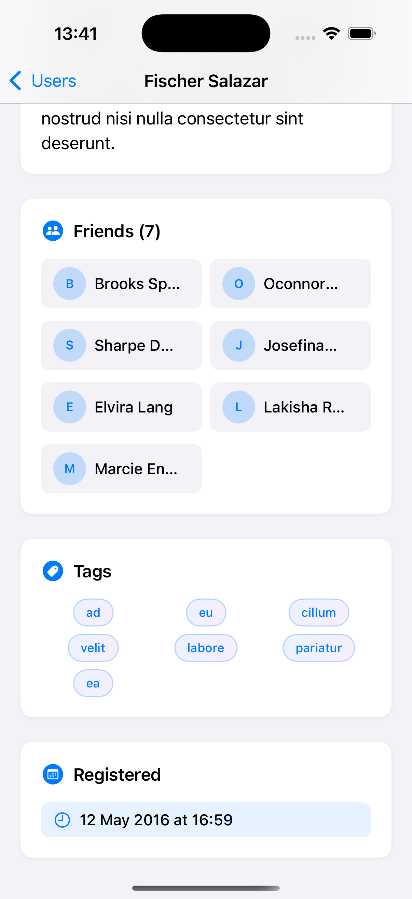

# Challenge5FriendFace - Social Network App

A comprehensive SwiftUI social network application that fetches user data from a remote API and displays detailed user profiles. Features SwiftData integration, network requests, and a beautiful user interface for browsing social connections.

## Screenshots

    
    
    

## Features

- **User Directory**: Browse all users with active/inactive status indicators
- **Detailed Profiles**: Comprehensive user information including contact details
- **Friends Network**: View user's friends with visual friend cards
- **Tags System**: Display user tags with styled tag chips
- **API Integration**: Fetches data from remote JSON API
- **SwiftData Storage**: Persistent local storage of user data
- **Beautiful UI**: Modern card-based design with gradients and shadows

## How It Works

1. **Load Data**: App fetches user data from remote API on first launch
2. **Browse Users**: View all users with their active status
3. **View Profile**: Tap any user to see detailed profile information
4. **Explore Connections**: See user's friends and social connections
5. **View Tags**: Browse user's interests and skills
6. **Persistent Storage**: Data is saved locally for offline access

## Profile Information

- **Basic Info**: Name, age, company, and status
- **Contact Details**: Email and address information
- **About Section**: Personal description and bio
- **Friends List**: Visual grid of user's friends
- **Tags**: Skills, interests, and categories
- **Registration Date**: When the user joined

## Technical Details

- **Platform**: iOS 17.0+
- **Language**: Swift
- **Framework**: SwiftUI + SwiftData
- **Architecture**: MVVM with data persistence
- **Key Concepts**: @Query, @Model, URLSession, JSON decoding, navigation
- **Target**: iPhone (Portrait orientation)

## Setup Instructions

1. Open `Challenge5FriendFace.xcodeproj` in Xcode
2. Select your target device or simulator
3. Build and run the project (⌘+R)
4. Browse the social network!

## Requirements

- Xcode 15.0 or later
- iOS 17.0 or later
- Swift 5.9 or later
- Internet connection for initial data loading

## About

This project is part of the "100 Days of SwiftUI" challenge. It demonstrates:

- **Network Programming**: Fetching data from remote APIs
- **JSON Parsing**: Decoding complex JSON structures
- **SwiftData Integration**: @Model classes and data persistence
- **Complex UI**: Multi-section layouts with custom styling
- **Navigation**: Master-detail navigation patterns
- **Async Programming**: Using async/await for network requests

## Author

Created by Ahmet Büyükçelik as part of 100 Days of SwiftUI learning journey.

---

*Connect with friends in a beautiful interface! 👥🌐*
