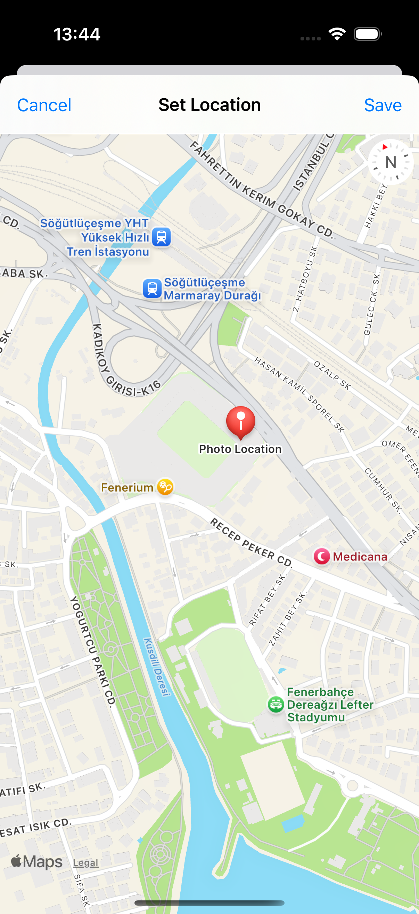

# Challenge6FriendName - Photo-Based Friend Tracker

A SwiftUI application for managing friends with photos and location data. Users can add friends by selecting photos from their library, entering names, and optionally adding location information using Core Location and MapKit.

## Screenshots

    
    
    
    

## Features

- **Photo-Based Friends**: Add friends with their photos from photo library
- **Location Integration**: Optional location tracking using Core Location
- **Map Integration**: View and set friend locations on a map
- **SwiftData Storage**: Persistent storage with external photo storage
- **Photo Picker**: Native PhotosPicker for selecting images
- **Friend Management**: Add, view, and delete friends
- **Location Permissions**: Proper handling of location permissions

## How It Works

1. **Add Friend**: Tap the + button to add a new friend
2. **Select Photo**: Choose a photo from your photo library
3. **Enter Name**: Provide the friend's name
4. **Set Location**: Optionally set their location on a map
5. **Save Friend**: Friend is saved with photo and location data
6. **View Friends**: Browse all friends with their photos
7. **Manage Friends**: Swipe to delete unwanted friends

## Technical Features

- **PhotosPicker**: Native iOS photo selection
- **Core Location**: GPS location tracking
- **MapKit**: Interactive map for location selection
- **External Storage**: Efficient photo storage with @Attribute(.externalStorage)
- **Permission Handling**: Proper location permission requests

## Technical Details

- **Platform**: iOS 17.0+
- **Language**: Swift
- **Framework**: SwiftUI + SwiftData + Core Location + MapKit
- **Architecture**: MVVM with location services
- **Key Concepts**: PhotosPicker, CLLocationManager, MapKit, external storage
- **Target**: iPhone (Portrait orientation)

## Setup Instructions

1. Open `Challenge6FriendName.xcodeproj` in Xcode
2. Select your target device or simulator
3. Build and run the project (⌘+R)
4. Start adding friends with photos!

## Requirements

- Xcode 15.0 or later
- iOS 17.0 or later
- Swift 5.9 or later
- Photo library access permission
- Location permission (optional)

## About

This project is part of the "100 Days of SwiftUI" challenge. It demonstrates:

- **Photo Integration**: Using PhotosPicker for image selection
- **Location Services**: Core Location and CLLocationManager
- **MapKit Integration**: Interactive maps for location selection
- **External Storage**: Efficient storage of large binary data
- **Permission Handling**: Requesting and managing system permissions
- **Complex Navigation**: Multiple sheets and navigation flows

## Author

Created by Ahmet Büyükçelik as part of 100 Days of SwiftUI learning journey.

---

*Remember friends with photos and locations! 📸📍👥*
