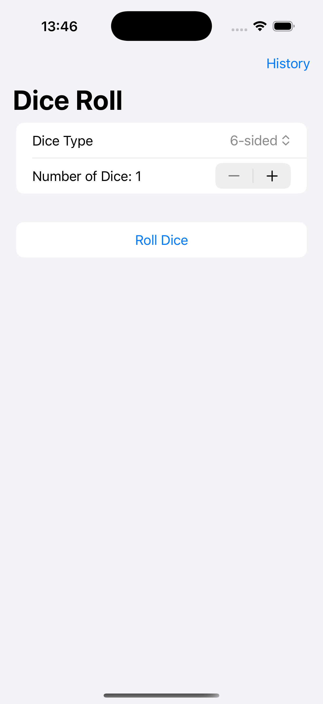
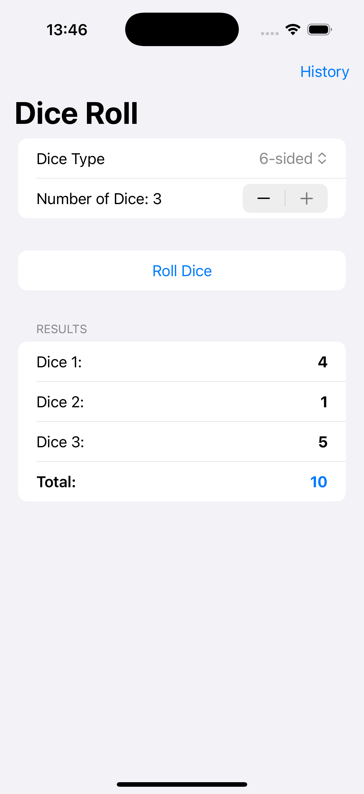
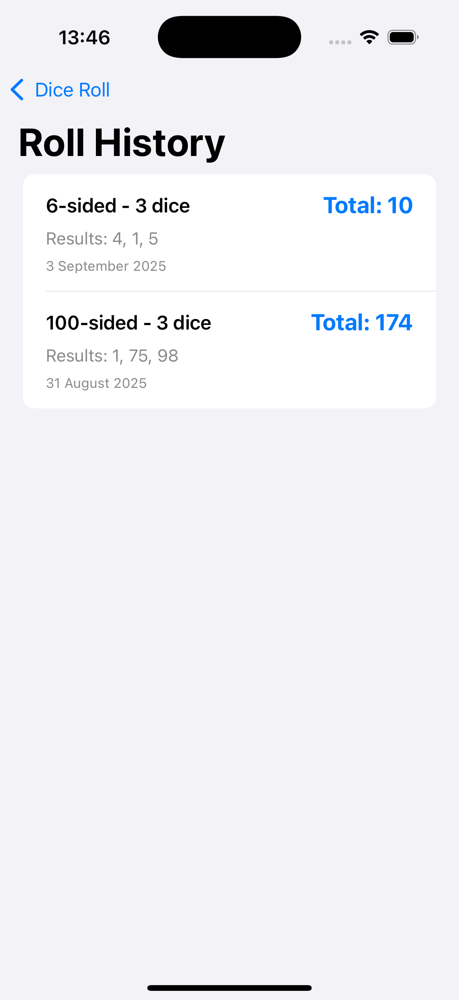

# Challenge7DiceRoll - Advanced Dice Rolling App

A comprehensive SwiftUI dice rolling application with multiple dice types, roll history tracking, and animated rolling effects. Features SwiftData integration for persistent storage of roll history and sensory feedback for enhanced user experience.

## Screenshots

    
    
    

## Features

- **Multiple Dice Types**: 4, 6, 8, 10, 12, 20, and 100-sided dice
- **Multiple Dice**: Roll 1-3 dice simultaneously
- **Animated Rolling**: Visual rolling animation with timer-based updates
- **Roll History**: Persistent storage of all previous rolls
- **Sensory Feedback**: Haptic feedback during rolling animation
- **Total Calculation**: Automatic sum calculation for multiple dice
- **SwiftData Integration**: Persistent storage with @Model classes

## How It Works

1. **Select Dice Type**: Choose from 7 different dice types
2. **Set Dice Count**: Use stepper to select 1-3 dice
3. **Roll Dice**: Tap roll button to start animated rolling
4. **View Results**: See individual dice results and total
5. **Check History**: View all previous rolls in history
6. **Automatic Saving**: All rolls are automatically saved

## Dice Types Available

- **4-sided** (d4)
- **6-sided** (d6) - Standard dice
- **8-sided** (d8)
- **10-sided** (d10)
- **12-sided** (d12)
- **20-sided** (d20) - Popular for RPGs
- **100-sided** (d100) - Percentage dice

## Technical Features

- **Animated Rolling**: Timer-based animation with 10 iterations
- **Sensory Feedback**: Haptic feedback using sensoryFeedback modifier
- **SwiftData Storage**: @Model classes for persistent data
- **History Tracking**: Complete roll history with timestamps
- **Form Interface**: Clean, organized form-based UI

## Technical Details

- **Platform**: iOS 17.0+
- **Language**: Swift
- **Framework**: SwiftUI + SwiftData
- **Architecture**: MVVM with data persistence
- **Key Concepts**: @Model, @Query, Timer, sensory feedback, enums
- **Target**: iPhone (Portrait orientation)

## Setup Instructions

1. Open `Challenge7DiceRoll.xcodeproj` in Xcode
2. Select your target device or simulator
3. Build and run the project (⌘+R)
4. Start rolling dice!

## Requirements

- Xcode 15.0 or later
- iOS 17.0 or later
- Swift 5.9 or later

## About

This project is part of the "100 Days of SwiftUI" challenge. It demonstrates:

- **Advanced SwiftData**: Complex @Model classes with relationships
- **Animation Techniques**: Timer-based rolling animations
- **Sensory Feedback**: Haptic feedback integration
- **Data Persistence**: Complete roll history storage
- **Enum Usage**: Custom dice type enumeration
- **Form Design**: Complex form layouts with multiple sections

## Author

Created by Ahmet Büyükçelik as part of 100 Days of SwiftUI learning journey.

---

*Roll the dice with style and track your luck! 🎲📊*
