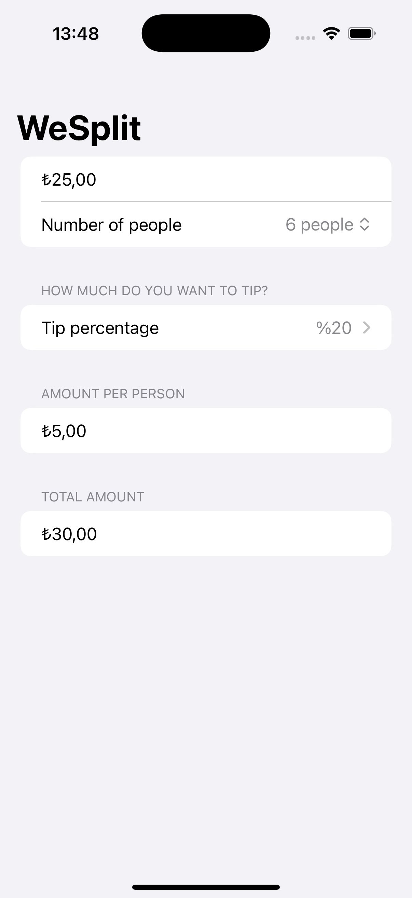

# Project1-WeSplit - Bill Splitting Calculator

A SwiftUI application for calculating bill splitting with tip calculations. Perfect for restaurants and group dining, this app helps you split bills fairly among multiple people with customizable tip percentages.

## Screenshots

## Features

- **Bill Amount Input**: Enter the total bill amount with currency formatting
- **People Counter**: Select number of people (2-99) to split the bill
- **Tip Calculator**: Choose tip percentage from 0% to 100%
- **Per-Person Calculation**: Automatic calculation of amount per person
- **Total Amount Display**: Shows total bill including tip
- **Currency Formatting**: Automatic currency formatting based on locale
- **Visual Feedback**: Red text when no tip is selected

## How It Works

1. **Enter Bill Amount**: Type the total bill amount
2. **Select People**: Choose how many people are splitting the bill
3. **Choose Tip**: Select tip percentage (0-100%)
4. **View Results**: See amount per person and total bill
5. **Done Button**: Tap Done to dismiss keyboard

## Calculations

- **Tip Amount**: Bill amount × tip percentage
- **Total Bill**: Original amount + tip amount
- **Per Person**: Total bill ÷ number of people

## Technical Details

- **Platform**: iOS 17.0+
- **Language**: Swift
- **Framework**: SwiftUI
- **Architecture**: Simple state management with computed properties
- **Key Concepts**: @State, @FocusState, computed properties, currency formatting
- **Target**: iPhone (Portrait orientation)

## Setup Instructions

1. Open `WeSplit.xcodeproj` in Xcode
2. Select your target device or simulator
3. Build and run the project (⌘+R)
4. Start splitting bills!

## Requirements

- Xcode 15.0 or later
- iOS 17.0 or later
- Swift 5.9 or later

## About

This project is part of the "100 Days of SwiftUI" challenge. It demonstrates:

- **Form Design**: Creating organized forms with sections
- **State Management**: Using @State for user input
- **Computed Properties**: Dynamic calculations based on user input
- **Currency Formatting**: Locale-aware currency display
- **Focus Management**: @FocusState for keyboard handling
- **User Experience**: Clean, intuitive bill splitting interface

## Author

Created by Ahmet Büyükçelik as part of 100 Days of SwiftUI learning journey.

---

*Split bills fairly and easily! 💰🧮*
