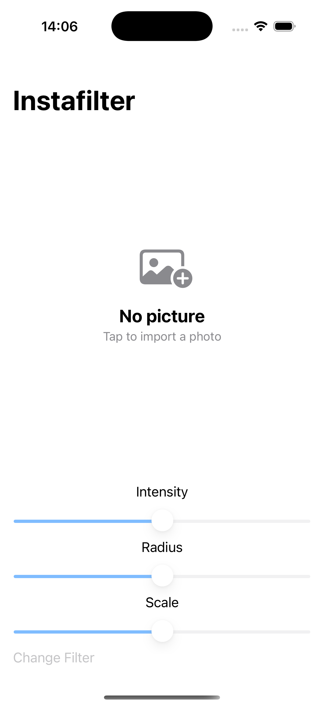
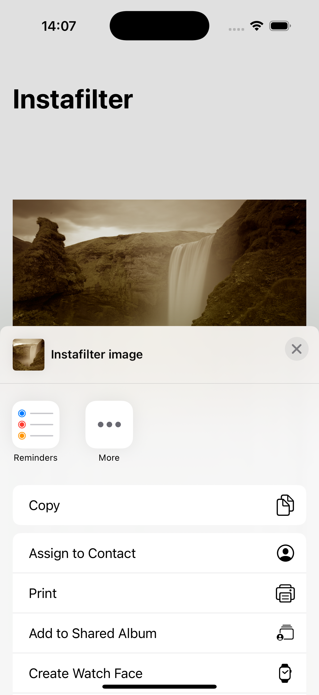

# Project10-Instafilter - Photo Filter App

A SwiftUI photo editing application with Core Image integration. Features multiple filters, real-time adjustments, and photo sharing capabilities for creating stunning filtered images.

## Screenshots

    
    
    
    

## Features

- **Photo Selection**: Choose photos from your photo library
- **Multiple Filters**: 11 different Core Image filters
- **Real-time Adjustments**: Live filter intensity, radius, and scale controls
- **Filter Categories**: Various filter types including artistic and enhancement effects
- **Photo Sharing**: ShareLink integration for sharing filtered images
- **App Store Reviews**: Automatic review prompts after 20 filter uses
- **Professional Filters**: Core Image integration for high-quality processing

## Available Filters

- **Crystallize**: Creates crystal-like patterns
- **Edges**: Highlights image edges
- **Gaussian Blur**: Smooth blur effect
- **Pixellate**: Pixelated mosaic effect
- **Sepia Tone**: Vintage brown tone
- **Unsharp Mask**: Sharpening effect
- **Vignette**: Dark edges with bright center
- **Vibrance**: Enhanced color saturation
- **Fade**: Desaturated vintage look
- **Gloom**: Dark, moody effect

## How It Works

1. **Select Photo**: Tap to choose a photo from your library
2. **Choose Filter**: Select from 11 different filter options
3. **Adjust Settings**: Use sliders to fine-tune intensity, radius, and scale
4. **Preview Changes**: See real-time filter effects
5. **Share Image**: Use ShareLink to share your filtered photo
6. **Try Different Filters**: Experiment with various filter combinations

## Technical Features

- **Core Image Integration**: CIFilter and CIContext for image processing
- **PhotosPicker**: Native photo selection from library
- **Real-time Processing**: Live filter application with sliders
- **ShareLink**: Native iOS sharing capabilities
- **StoreKit Integration**: App Store review prompts
- **AppStorage**: Persistent filter usage tracking

## Technical Details

- **Platform**: iOS 17.0+
- **Language**: Swift
- **Framework**: SwiftUI + Core Image + PhotosUI
- **Architecture**: Image processing with real-time updates
- **Key Concepts**: Core Image, CIFilter, PhotosPicker, ShareLink, StoreKit
- **Target**: iPhone (Portrait orientation)

## Setup Instructions

1. Open `Instafilter.xcodeproj` in Xcode
2. Select your target device or simulator
3. Build and run the project (⌘+R)
4. Start filtering photos!

## Requirements

- Xcode 15.0 or later
- iOS 17.0 or later
- Swift 5.9 or later
- Photo library access permission

## About

This project is part of the "100 Days of SwiftUI" challenge. It demonstrates:

- **Core Image Integration**: Advanced image processing with CIFilter
- **PhotosPicker**: Native photo selection and handling
- **Real-time Processing**: Live filter application and adjustments
- **ShareLink**: Native iOS sharing capabilities
- **StoreKit**: App Store review integration
- **Image Processing**: Complex image manipulation and filtering

## Author

Created by Ahmet Büyükçelik as part of 100 Days of SwiftUI learning journey.

---

*Transform your photos with professional filters! 📸✨*
