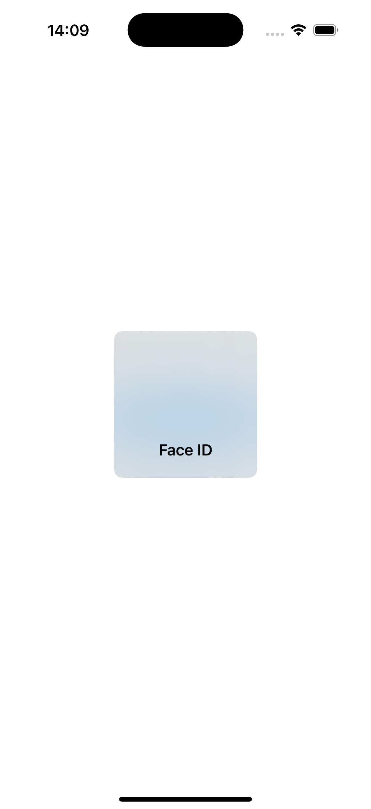
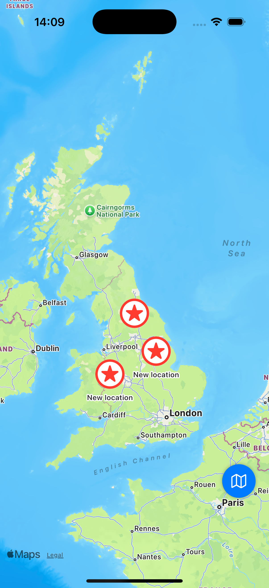
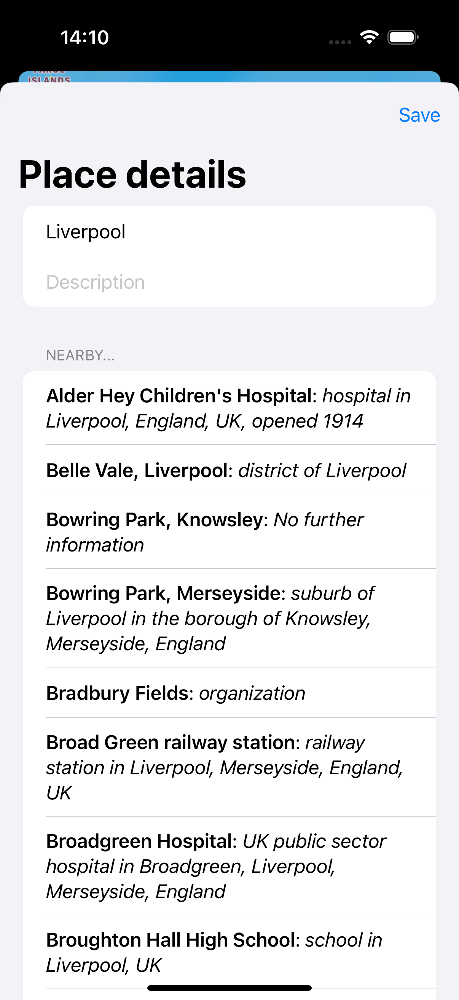

# Project11-BucketList - Interactive Map Bucket List

A SwiftUI application for creating and managing a bucket list of places to visit. Features interactive maps, location management, biometric authentication, and detailed place editing with MapKit integration.

## Screenshots

    
    
    

## Features

- **Interactive Maps**: Full MapKit integration with tap-to-add locations
- **Location Management**: Add, edit, and manage bucket list locations
- **Biometric Authentication**: Face ID/Touch ID for app security
- **Map Types**: Toggle between standard and hybrid map views
- **Location Details**: Comprehensive place information and descriptions
- **Visual Annotations**: Star markers for bucket list locations
- **Long Press Gestures**: Edit locations with long press interactions

## How It Works

1. **Authenticate**: Use Face ID/Touch ID to unlock the app
2. **View Map**: See your bucket list locations on an interactive map
3. **Add Locations**: Tap anywhere on the map to add new places
4. **Edit Places**: Long press on location markers to edit details
5. **Toggle Map Type**: Switch between standard and hybrid views
6. **Manage List**: Add descriptions and details for each location

## Map Features

- **Interactive Annotations**: Tap and long press interactions
- **Map Reader**: Convert screen coordinates to map coordinates
- **Map Styles**: Standard and hybrid map type options
- **Location Markers**: Visual star markers for bucket list items
- **Coordinate Conversion**: Precise location placement

## Security Features

- **Biometric Authentication**: Face ID/Touch ID integration
- **Secure Storage**: Protected location data storage
- **Authentication Errors**: Proper error handling and user feedback

## Technical Features

- **MapKit Integration**: Full map functionality with annotations
- **LocalAuthentication**: Biometric authentication framework
- **MapReader**: Advanced map interaction handling
- **Sheet Presentations**: Modal editing interfaces
- **State Management**: Complex view model with location data

## Technical Details

- **Platform**: iOS 17.0+
- **Language**: Swift
- **Framework**: SwiftUI + MapKit + LocalAuthentication
- **Architecture**: MVVM with map integration
- **Key Concepts**: MapKit, LocalAuthentication, MapReader, annotations
- **Target**: iPhone (Portrait orientation)

## Setup Instructions

1. Open `BucketList.xcodeproj` in Xcode
2. Select your target device or simulator
3. Build and run the project (⌘+R)
4. Start building your bucket list!

## Requirements

- Xcode 15.0 or later
- iOS 17.0 or later
- Swift 5.9 or later
- Device with Face ID/Touch ID (for authentication)

## About

This project is part of the "100 Days of SwiftUI" challenge. It demonstrates:

- **MapKit Integration**: Advanced map functionality and interactions
- **LocalAuthentication**: Biometric authentication implementation
- **MapReader**: Complex map coordinate conversion
- **Location Services**: Managing and displaying location data
- **Security**: Implementing app-level security with biometrics
- **User Experience**: Intuitive map-based interface design

## Author

Created by Ahmet Büyükçelik as part of 100 Days of SwiftUI learning journey.

---

*Plan your adventures with an interactive map! 🗺️⭐*
