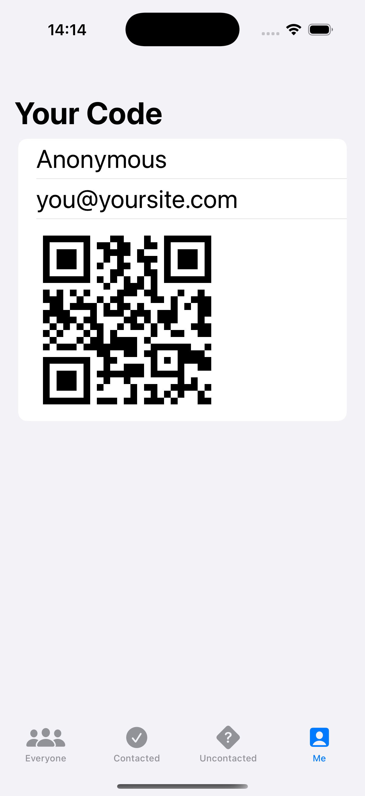
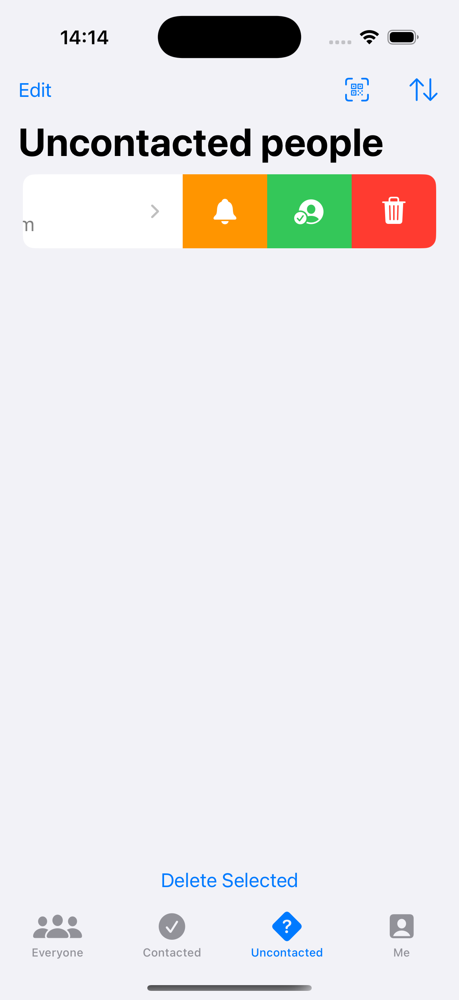
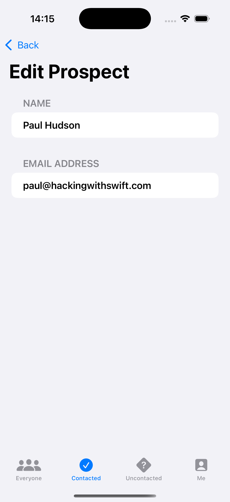

# Project12-HotProspects - Contact Management App

A SwiftUI contact management application with tabbed navigation and filtering capabilities. Features prospect tracking, contact status management, and user profile management for organizing business contacts and leads.

## Screenshots

    
    
    
    

## Features

- **Tabbed Navigation**: Four-tab interface for different views
- **Contact Filtering**: Filter contacts by status (contacted/uncontacted)
- **Prospect Management**: Add, edit, and manage business prospects
- **Status Tracking**: Track contact status and follow-up actions
- **User Profile**: Personal profile management
- **Contact Organization**: Organize contacts by business categories
- **Data Persistence**: SwiftData integration for contact storage

## Tab Organization

- **Everyone**: View all contacts and prospects
- **Contacted**: Filter to show only contacted prospects
- **Uncontacted**: Filter to show only uncontacted prospects
- **Me**: Personal profile and settings

## How It Works

1. **Browse Contacts**: View all prospects in the Everyone tab
2. **Filter by Status**: Use Contacted/Uncontacted tabs for specific views
3. **Add Prospects**: Add new business contacts and leads
4. **Update Status**: Mark contacts as contacted or uncontacted
5. **Manage Profile**: Update personal information in the Me tab
6. **Track Progress**: Monitor your contact management progress

## Contact Management

- **Prospect Tracking**: Comprehensive contact information
- **Status Management**: Contacted vs. uncontacted status
- **Business Focus**: Designed for business contact management
- **Follow-up Tracking**: Monitor contact follow-up actions

## Technical Features

- **TabView Navigation**: Multi-tab interface with filtering
- **SwiftData Integration**: Persistent contact storage
- **Filtering System**: Dynamic contact filtering by status
- **User Interface**: Clean, business-focused design
- **Data Management**: CRUD operations for contact management

## Technical Details

- **Platform**: iOS 17.0+
- **Language**: Swift
- **Framework**: SwiftUI + SwiftData
- **Architecture**: Tabbed navigation with data filtering
- **Key Concepts**: TabView, filtering, SwiftData, contact management
- **Target**: iPhone (Portrait orientation)

## Setup Instructions

1. Open `HotProspects.xcodeproj` in Xcode
2. Select your target device or simulator
3. Build and run the project (⌘+R)
4. Start managing your prospects!

## Requirements

- Xcode 15.0 or later
- iOS 17.0 or later
- Swift 5.9 or later

## About

This project is part of the "100 Days of SwiftUI" challenge. It demonstrates:

- **TabView Navigation**: Multi-tab interface design
- **Data Filtering**: Dynamic filtering based on contact status
- **SwiftData Integration**: Contact data persistence
- **Business Applications**: Contact management system design
- **User Interface**: Professional business app interface
- **Data Organization**: Structured contact management

## Author

Created by Ahmet Büyükçelik as part of 100 Days of SwiftUI learning journey.

---

*Manage your business prospects effectively! 📞💼*
