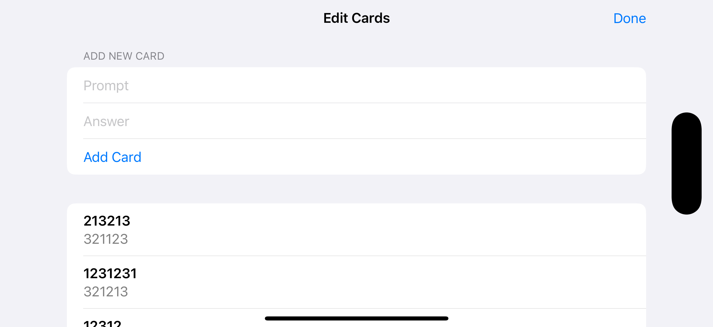

# Project13-Flashzilla - Flashcard Learning App

A SwiftUI flashcard application with timer-based learning sessions. Features stacked card interface, accessibility support, and customizable flashcard management for effective learning and memorization.

## Screenshots

    
    
    

## Features

- **Stacked Card Interface**: Beautiful stacked card design with depth
- **Timer-Based Learning**: 100-second learning sessions with countdown
- **Card Management**: Add, edit, and manage custom flashcards
- **Accessibility Support**: VoiceOver and color-blind friendly design
- **Smart Card Handling**: Incorrect cards return to the bottom of the stack
- **Background Management**: Pause timer when app goes to background
- **Visual Feedback**: Animated card interactions and transitions

## How It Works

1. **Start Session**: Begin a 100-second learning session
2. **Answer Cards**: Swipe or tap to answer flashcard questions
3. **Track Progress**: Monitor remaining time and cards
4. **Handle Incorrect Answers**: Wrong cards return to the stack
5. **Complete Session**: Finish when time runs out or all cards are answered
6. **Edit Cards**: Add new flashcards or modify existing ones

## Learning Features

- **Spaced Repetition**: Incorrect cards are re-queued for review
- **Timer Pressure**: Time-limited sessions for focused learning
- **Visual Stack**: See remaining cards in a stacked interface
- **Progress Tracking**: Monitor learning progress and completion

## Accessibility Features

- **VoiceOver Support**: Full VoiceOver integration for screen readers
- **Color-Blind Friendly**: Alternative visual indicators for accessibility
- **Button Alternatives**: Dedicated buttons for correct/incorrect answers
- **Accessibility Labels**: Descriptive labels for all interactive elements

## Technical Features

- **Timer Integration**: Publisher-based timer with background handling
- **Scene Phase Monitoring**: App lifecycle management for timer control
- **Card Stacking**: Custom view modifier for stacked card interface
- **Animation System**: Smooth transitions and card interactions
- **Environment Values**: Accessibility and scene phase monitoring

## Technical Details

- **Platform**: iOS 17.0+
- **Language**: Swift
- **Framework**: SwiftUI
- **Architecture**: Environment-based state management
- **Key Concepts**: Timer, accessibility, scene phase, custom modifiers
- **Target**: iPhone (Portrait orientation)

## Setup Instructions

1. Open `Flashzilla.xcodeproj` in Xcode
2. Select your target device or simulator
3. Build and run the project (⌘+R)
4. Start learning with flashcards!

## Requirements

- Xcode 15.0 or later
- iOS 17.0 or later
- Swift 5.9 or later

## About

This project is part of the "100 Days of SwiftUI" challenge. It demonstrates:

- **Timer Integration**: Publisher-based timer with lifecycle management
- **Accessibility**: Comprehensive accessibility support and VoiceOver
- **Custom UI**: Stacked card interface with custom view modifiers
- **Animation**: Smooth transitions and interactive feedback
- **App Lifecycle**: Scene phase monitoring and background handling
- **Learning Design**: Educational app interface and user experience

## Author

Created by Ahmet Büyükçelik as part of 100 Days of SwiftUI learning journey.

---

*Learn effectively with timed flashcard sessions! 📚⏰*
