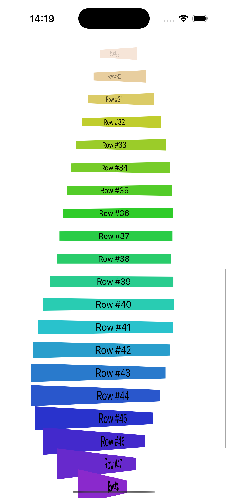

# Project14-LayoutAndGeometry - Advanced Layout Effects

A SwiftUI application demonstrating advanced layout and geometry effects. Features dynamic color changes, scaling, opacity, and 3D rotation effects based on scroll position and geometry calculations.

## Screenshots

## Features

- **Dynamic Color Changes**: Colors shift based on scroll position
- **Opacity Effects**: Fade in/out effects as items scroll
- **Scaling Effects**: Dynamic scaling based on position
- **3D Rotation**: 3D rotation effects using GeometryReader
- **Scroll-Based Animation**: All effects respond to scroll position
- **Geometry Calculations**: Advanced coordinate and frame calculations
- **Performance Optimized**: LazyVStack for efficient scrolling

## How It Works

1. **Scroll Through List**: Scroll through 50 numbered rows
2. **Watch Color Changes**: Colors dynamically shift as you scroll
3. **Observe Opacity**: Items fade in and out based on position
4. **See Scaling**: Items scale up and down dynamically
5. **Experience 3D Effects**: 3D rotation effects as items move
6. **Smooth Performance**: Optimized scrolling with LazyVStack

## Visual Effects

- **Color Transitions**: Smooth hue changes from red to purple
- **Opacity Fade**: Items fade in when entering view
- **Scale Animation**: Dynamic scaling from 0.5x to 1.0x
- **3D Rotation**: Y-axis rotation based on scroll position
- **Smooth Transitions**: All effects animate smoothly

## Technical Features

- **GeometryReader**: Advanced geometry calculations and coordinate tracking
- **Frame Calculations**: Global coordinate system for position tracking
- **Mathematical Effects**: Complex calculations for visual effects
- **Performance Optimization**: LazyVStack for efficient rendering
- **Coordinate Systems**: Multiple coordinate system usage

## Technical Details

- **Platform**: iOS 17.0+
- **Language**: Swift
- **Framework**: SwiftUI
- **Architecture**: Geometry-based visual effects
- **Key Concepts**: GeometryReader, coordinate systems, mathematical effects
- **Target**: iPhone (Portrait orientation)

## Setup Instructions

1. Open `LayoutAndGeometry.xcodeproj` in Xcode
2. Select your target device or simulator
3. Build and run the project (⌘+R)
4. Scroll to see the effects!

## Requirements

- Xcode 15.0 or later
- iOS 17.0 or later
- Swift 5.9 or later

## About

This project is part of the "100 Days of SwiftUI" challenge. It demonstrates:

- **GeometryReader**: Advanced geometry calculations and tracking
- **Coordinate Systems**: Global and local coordinate system usage
- **Mathematical Effects**: Complex calculations for visual effects
- **Performance**: LazyVStack optimization for smooth scrolling
- **Visual Design**: Advanced layout and animation techniques
- **Scroll Effects**: Position-based visual transformations

## Author

Created by Ahmet Büyükçelik as part of 100 Days of SwiftUI learning journey.

---

*Explore advanced layout and geometry effects! 📐✨*
