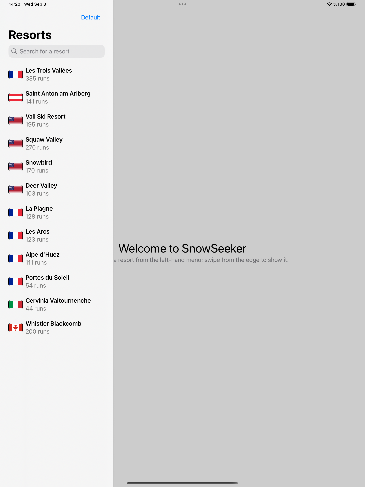
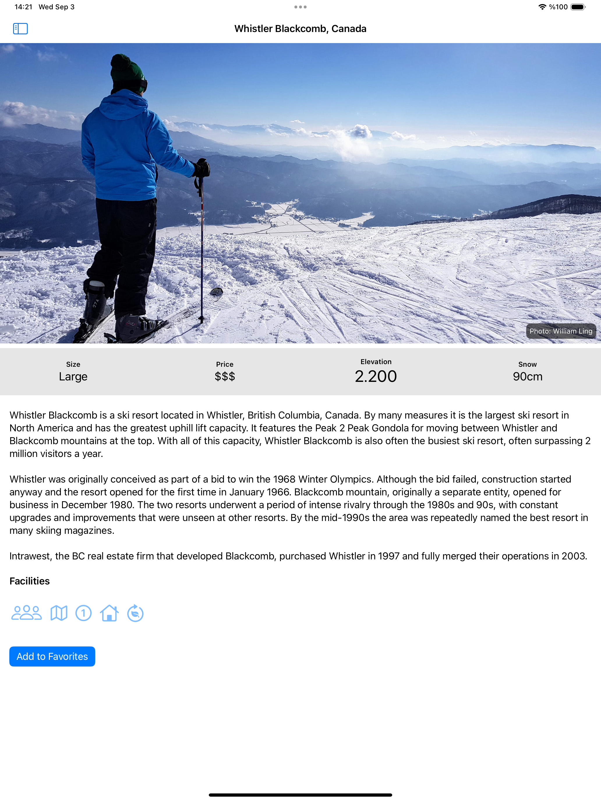

# Project15-SnowSeeker - Ski Resort Finder

A SwiftUI ski resort discovery application with comprehensive search, sorting, and favorites functionality. Features detailed resort information, country flags, and iPad-optimized split-view navigation for finding the perfect ski destination.

## Screenshots

    
    

## Features

- **Resort Database**: Comprehensive ski resort information with runs and details
- **Search Functionality**: Real-time search through resort names
- **Multiple Sorting**: Sort by default, alphabetical, or country
- **Favorites System**: Mark and manage favorite resorts
- **Country Flags**: Visual country identification with flag images
- **Split-View Navigation**: iPad-optimized master-detail interface
- **Resort Details**: Comprehensive resort information and amenities

## How It Works

1. **Browse Resorts**: View all available ski resorts with country flags
2. **Search Resorts**: Use the search bar to find specific resorts
3. **Sort Options**: Choose from default, alphabetical, or country sorting
4. **Mark Favorites**: Tap to add resorts to your favorites list
5. **View Details**: Tap any resort to see detailed information
6. **Plan Your Trip**: Use the app to plan your ski vacation

## Sorting Options

- **Default Order**: Original resort listing order
- **Alphabetical**: Sort resorts by name (A-Z)
- **Country**: Sort by country, then by resort name

## Search Features

- **Real-time Search**: Instant filtering as you type
- **Case-insensitive**: Search works regardless of capitalization
- **Localized Search**: Supports international character sets

## Technical Features

- **NavigationSplitView**: iPad-optimized split-view interface
- **Searchable**: Native iOS search functionality
- **JSON Data**: Resort data loaded from bundled JSON file
- **Favorites Management**: Persistent favorites with @Observable
- **Accessibility**: VoiceOver support for all elements

## Technical Details

- **Platform**: iOS 17.0+
- **Language**: Swift
- **Framework**: SwiftUI
- **Architecture**: Data-driven UI with search and sorting
- **Key Concepts**: NavigationSplitView, searchable, JSON decoding, favorites
- **Target**: iPhone and iPad (Universal)

## Setup Instructions

1. Open `SnowSeeker.xcodeproj` in Xcode
2. Select your target device or simulator
3. Build and run the project (⌘+R)
4. Start exploring ski resorts!

## Requirements

- Xcode 15.0 or later
- iOS 17.0 or later
- Swift 5.9 or later

## About

This project is part of the "100 Days of SwiftUI" challenge. It demonstrates:

- **NavigationSplitView**: iPad-optimized navigation patterns
- **Search Integration**: Native iOS searchable functionality
- **Data Management**: JSON loading and complex sorting
- **Favorites System**: User preference management
- **Universal Design**: iPhone and iPad optimized interfaces
- **Travel Apps**: Real-world application for travel planning

## Author

Created by Ahmet Büyükçelik as part of 100 Days of SwiftUI learning journey.

---

*Find your perfect ski destination! 🎿🏔️*
