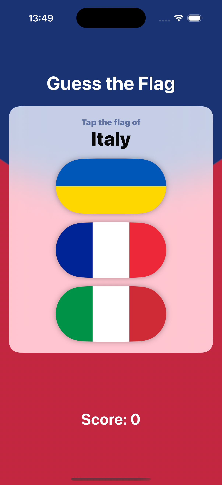
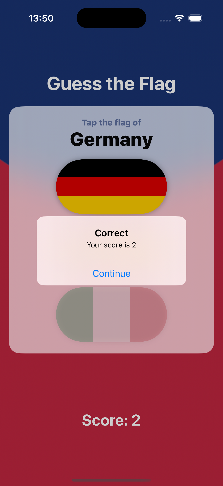

# Project2-GuessTheFlag - Interactive Flag Quiz Game

A SwiftUI flag recognition game that tests your knowledge of world flags. Features beautiful animations, scoring system, and accessibility support for an engaging educational experience.

## Screenshots

    
    

## Features

- **Flag Recognition**: Test your knowledge of 11 different country flags
- **Animated Interactions**: Beautiful 3D rotation and opacity animations
- **Scoring System**: Track your score with +1 for correct, -1 for incorrect
- **Game Progression**: 9 questions per game with final score display
- **Visual Feedback**: Animated flag responses with rotation effects
- **Accessibility Support**: VoiceOver descriptions for all flags
- **Beautiful Design**: Radial gradient background with material effects

## How It Works

1. **View Question**: See the country name you need to identify
2. **Choose Flag**: Tap the correct flag from three options
3. **See Animation**: Watch the selected flag rotate and others fade
4. **Get Feedback**: Receive immediate feedback on your choice
5. **Track Score**: Monitor your progress through 9 questions
6. **View Final Score**: See your total score at the end

## Supported Countries

- Estonia, France, Germany, Ireland, Italy
- Nigeria, Poland, Spain, UK, Ukraine, US

## Technical Features

- **3D Animations**: Rotation3DEffect for flag interactions
- **Accessibility**: VoiceOver support with detailed flag descriptions
- **Material Design**: Regular material background for content
- **Gradient Background**: Beautiful radial gradient design
- **State Management**: Complex state handling for animations and scoring

## Technical Details

- **Platform**: iOS 17.0+
- **Language**: Swift
- **Framework**: SwiftUI
- **Architecture**: State management with animations
- **Key Concepts**: @State, animations, accessibility, custom views
- **Target**: iPhone (Portrait orientation)

## Setup Instructions

1. Open `GuessTheFlag.xcodeproj` in Xcode
2. Select your target device or simulator
3. Build and run the project (⌘+R)
4. Start guessing flags!

## Requirements

- Xcode 15.0 or later
- iOS 17.0 or later
- Swift 5.9 or later

## About

This project is part of the "100 Days of SwiftUI" challenge. It demonstrates:

- **Animation Techniques**: 3D rotations and opacity changes
- **Accessibility**: VoiceOver integration and descriptive labels
- **Game Logic**: Scoring systems and game state management
- **Visual Design**: Gradients, materials, and custom styling
- **User Interaction**: Button handling with visual feedback
- **Educational Content**: Learning through interactive gameplay

## Author

Created by Ahmet Büyükçelik as part of 100 Days of SwiftUI learning journey.

---

*Test your flag knowledge with style! 🏴󠁧󠁢󠁥󠁮󠁧󠁿🎯*
