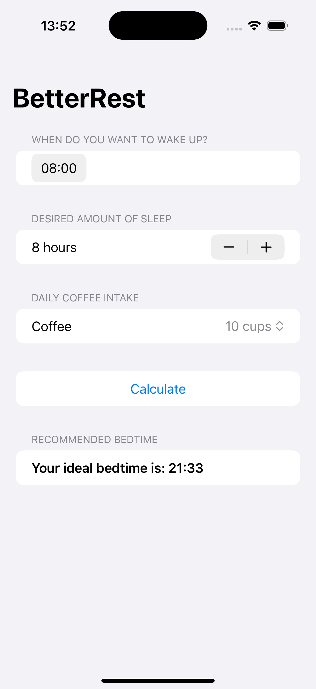

# Project3-BetterRest - AI-Powered Sleep Calculator

A SwiftUI application that uses Core ML machine learning to calculate your optimal bedtime based on wake-up time, desired sleep duration, and daily coffee intake. Features intelligent sleep recommendations powered by Apple's machine learning framework.

## Screenshots

## Features

- **AI-Powered Calculations**: Uses Core ML model for accurate sleep predictions
- **Customizable Inputs**: Set wake-up time, desired sleep duration, and coffee intake
- **Smart Recommendations**: Get personalized bedtime suggestions
- **Intuitive Interface**: Clean form-based design with easy controls
- **Precise Timing**: 15-minute increments for sleep duration
- **Coffee Impact**: Considers daily coffee consumption in calculations

## How It Works

1. **Set Wake-Up Time**: Choose when you want to wake up
2. **Choose Sleep Duration**: Select desired hours of sleep (4-12 hours)
3. **Enter Coffee Intake**: Specify daily coffee consumption (1-20 cups)
4. **Calculate Bedtime**: Tap calculate to get AI-powered recommendation
5. **View Results**: See your optimal bedtime based on the ML model

## Machine Learning Features

- **Core ML Integration**: Uses trained SleepCalculator model
- **Multi-Factor Analysis**: Considers wake time, sleep duration, and caffeine
- **Accurate Predictions**: ML model trained on sleep research data
- **Real-time Calculations**: Instant results based on your inputs

## Technical Details

- **Platform**: iOS 17.0+
- **Language**: Swift
- **Framework**: SwiftUI + Core ML
- **Architecture**: ML-powered calculations with state management
- **Key Concepts**: Core ML, MLModelConfiguration, date calculations
- **Target**: iPhone (Portrait orientation)

## Setup Instructions

1. Open `BetterRest.xcodeproj` in Xcode
2. Select your target device or simulator
3. Build and run the project (⌘+R)
4. Start optimizing your sleep!

## Requirements

- Xcode 15.0 or later
- iOS 17.0 or later
- Swift 5.9 or later

## About

This project is part of the "100 Days of SwiftUI" challenge. It demonstrates:

- **Core ML Integration**: Using machine learning models in SwiftUI
- **Date Handling**: Complex date calculations and formatting
- **Form Design**: Advanced form layouts with multiple input types
- **ML Predictions**: Making predictions with trained models
- **User Experience**: Clean interface for complex calculations
- **Health & Wellness**: Practical application for sleep optimization

## Author

Created by Ahmet Büyükçelik as part of 100 Days of SwiftUI learning journey.

---

*Sleep better with AI-powered recommendations! 😴🤖*
