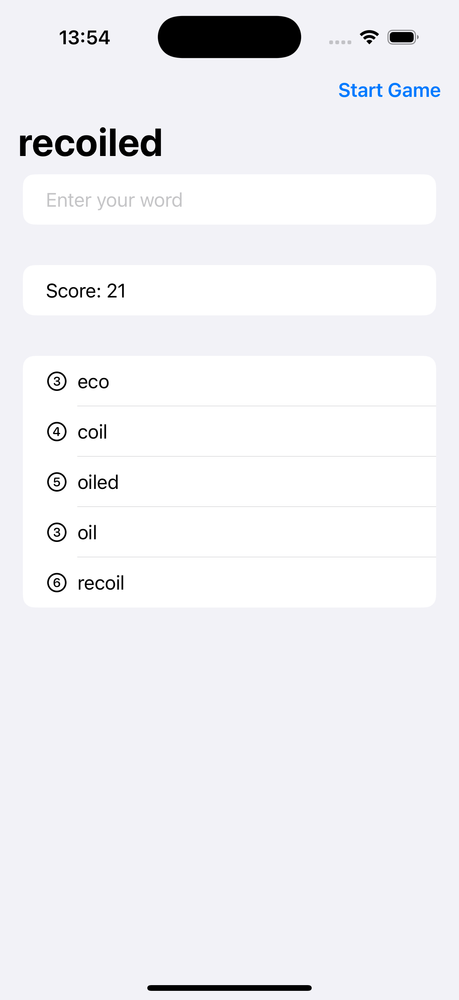

# Project4-WordScramble - Word Formation Game

A SwiftUI word game where players create words from a given root word. Features word validation, scoring system, and dictionary checking to create an engaging vocabulary-building experience.

## Screenshots

## Features

- **Word Formation**: Create words using letters from a root word
- **Dictionary Validation**: Real-time word checking using UITextChecker
- **Scoring System**: Points based on word length (longer words = more points)
- **Word Validation**: Multiple validation rules for fair gameplay
- **Random Root Words**: New root word for each game session
- **Used Words Tracking**: Prevents duplicate word submissions
- **Accessibility Support**: VoiceOver integration for word lists

## How It Works

1. **Get Root Word**: Start with a random word from the dictionary
2. **Form Words**: Create new words using only the letters from the root word
3. **Submit Words**: Type and submit valid words
4. **Earn Points**: Score points based on word length
5. **Track Progress**: See all your used words with letter counts
6. **Start New Game**: Get a new root word to continue playing

## Validation Rules

- **Minimum Length**: Words must be at least 3 letters long
- **Original Words**: Cannot use the same word twice
- **Letter Availability**: Can only use letters present in the root word
- **Real Words**: Must be valid English words (dictionary checked)
- **Not Root Word**: Cannot use the original root word

## Technical Features

- **UITextChecker**: Native iOS spell checking for word validation
- **File Reading**: Loads root words from bundled text file
- **String Manipulation**: Complex letter checking and word formation
- **Animation**: Smooth insertion of new words into the list
- **Accessibility**: VoiceOver support with word descriptions

## Technical Details

- **Platform**: iOS 17.0+
- **Language**: Swift
- **Framework**: SwiftUI
- **Architecture**: Game logic with validation systems
- **Key Concepts**: UITextChecker, file reading, string manipulation, validation
- **Target**: iPhone (Portrait orientation)

## Setup Instructions

1. Open `WordScramble.xcodeproj` in Xcode
2. Select your target device or simulator
3. Build and run the project (⌘+R)
4. Start forming words!

## Requirements

- Xcode 15.0 or later
- iOS 17.0 or later
- Swift 5.9 or later

## About

This project is part of the "100 Days of SwiftUI" challenge. It demonstrates:

- **File I/O**: Reading text files from app bundle
- **String Processing**: Complex string manipulation and validation
- **UITextChecker**: Native iOS spell checking integration
- **Game Logic**: Multi-rule validation systems
- **User Interface**: List-based game interface with scoring
- **Educational Content**: Vocabulary building through gameplay

## Author

Created by Ahmet Büyükçelik as part of 100 Days of SwiftUI learning journey.

---

*Build your vocabulary one word at a time! 📝🔤*
