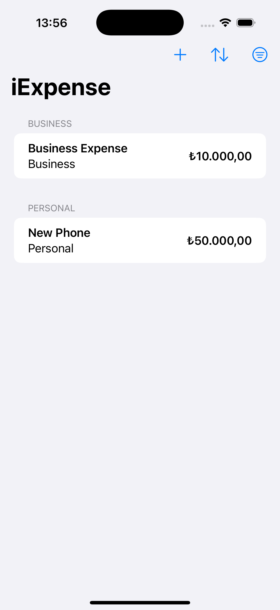
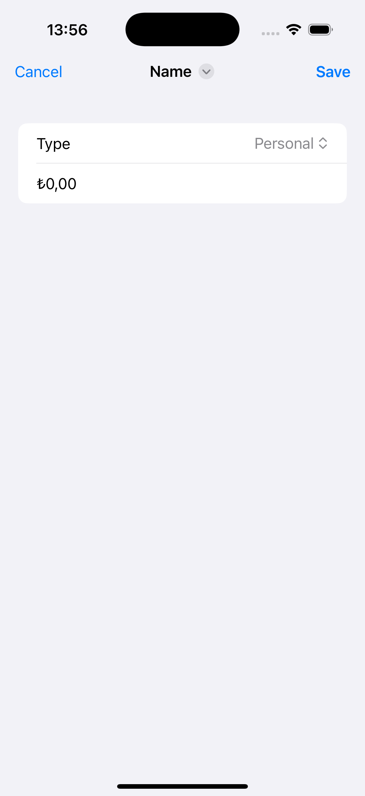

# Project5-iExpense - Personal Expense Tracker

A SwiftUI expense tracking application with SwiftData integration. Features categorized expenses, sorting options, filtering capabilities, and persistent storage for managing personal and business expenses.

## Screenshots

    
    

## Features

- **Expense Categories**: Separate tracking for Personal and Business expenses
- **Persistent Storage**: SwiftData integration for data persistence
- **Sorting Options**: Sort by name or amount (ascending/descending)
- **Filtering**: View all, personal only, or business only expenses
- **Currency Formatting**: Automatic currency formatting based on locale
- **Visual Indicators**: Different font sizes for high-value expenses
- **Swipe to Delete**: Easy expense removal with swipe gestures
- **Accessibility Support**: VoiceOver integration for expense items

## How It Works

1. **Add Expenses**: Tap + to add new personal or business expenses
2. **Categorize**: Choose between Personal or Business expense types
3. **Enter Details**: Provide expense name and amount
4. **View Expenses**: See categorized expenses with amounts
5. **Sort & Filter**: Use toolbar options to organize your view
6. **Manage Expenses**: Swipe to delete unwanted expenses

## Expense Categories

- **Personal**: Personal expenses and purchases
- **Business**: Business-related expenses and costs

## Sorting & Filtering

- **Sort Options**: Name (A-Z) or Amount (High to Low)
- **Filter Options**: All, Personal only, Business only
- **Visual Cues**: High-value expenses (>$10) shown in larger font

## Technical Features

- **SwiftData Integration**: @Model classes for data persistence
- **Dynamic Filtering**: Real-time filtering and sorting
- **Currency Formatting**: Locale-aware currency display
- **Accessibility**: VoiceOver support with descriptive labels
- **Menu Integration**: Native iOS menu components for sorting/filtering

## Technical Details

- **Platform**: iOS 17.0+
- **Language**: Swift
- **Framework**: SwiftUI + SwiftData
- **Architecture**: MVVM with data persistence
- **Key Concepts**: @Model, @Query, computed properties, filtering, sorting
- **Target**: iPhone (Portrait orientation)

## Setup Instructions

1. Open `iExpense.xcodeproj` in Xcode
2. Select your target device or simulator
3. Build and run the project (⌘+R)
4. Start tracking your expenses!

## Requirements

- Xcode 15.0 or later
- iOS 17.0 or later
- Swift 5.9 or later

## About

This project is part of the "100 Days of SwiftUI" challenge. It demonstrates:

- **SwiftData Integration**: @Model classes and data persistence
- **Complex Filtering**: Dynamic data filtering and sorting
- **User Interface**: Advanced toolbar with menus and navigation
- **Data Management**: CRUD operations with SwiftData
- **Accessibility**: VoiceOver integration and accessibility labels
- **Financial Apps**: Currency formatting and expense categorization

## Author

Created by Ahmet Büyükçelik as part of 100 Days of SwiftUI learning journey.

---

*Track your expenses with precision! 💰📊*
