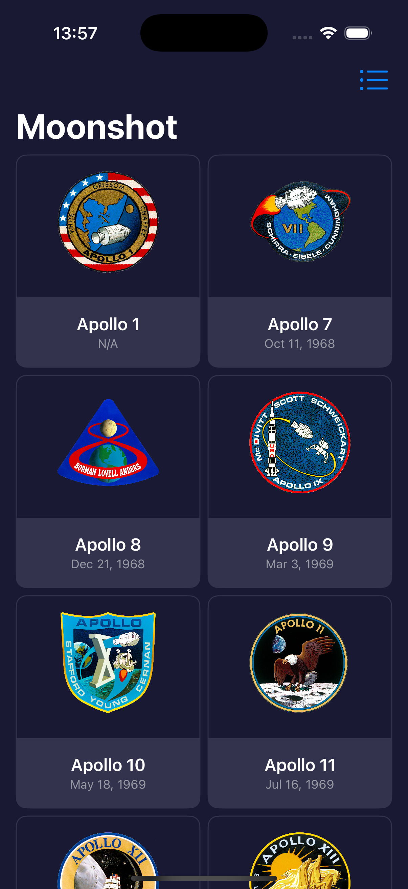
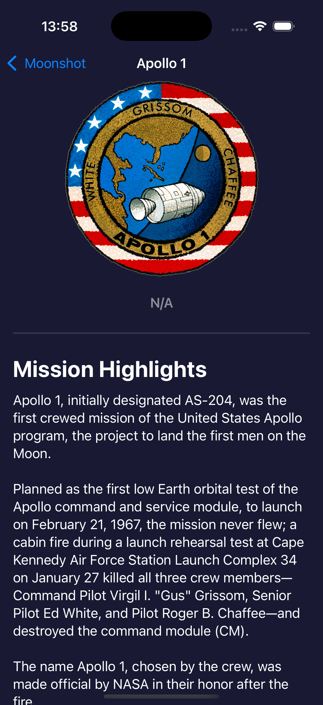
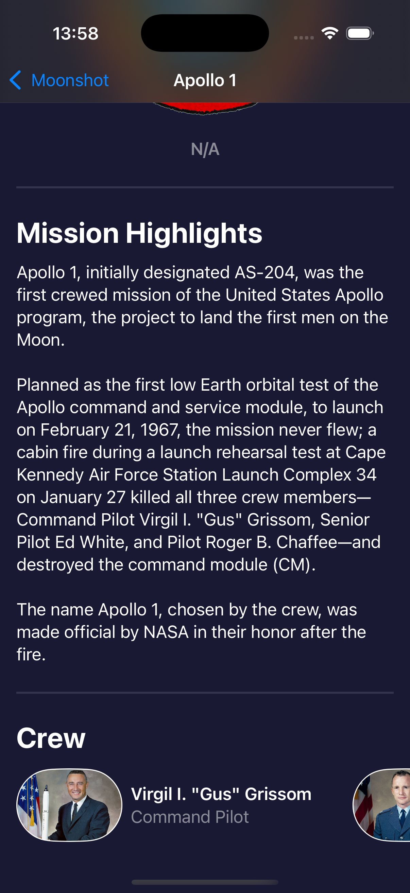

# Project6-Moonshot - Space Mission Explorer

A SwiftUI application showcasing NASA's space missions and astronaut information. Features beautiful grid and list views, detailed mission information, and comprehensive astronaut profiles with rich visual design.

## Screenshots

    
    
    

## Features

- **Mission Gallery**: Browse NASA space missions in grid or list view
- **Mission Details**: Comprehensive information about each space mission
- **Astronaut Profiles**: Detailed astronaut information and mission history
- **View Toggle**: Switch between grid and list layouts
- **Dark Theme**: Beautiful dark space-themed design
- **JSON Data**: Rich mission and astronaut data from bundled JSON files
- **Navigation**: Deep linking between missions and astronauts

## How It Works

1. **Browse Missions**: View all space missions in grid or list format
2. **Select Mission**: Tap any mission to see detailed information
3. **View Astronauts**: Tap astronaut names to see their profiles
4. **Toggle Views**: Switch between grid and list layouts
5. **Explore History**: Learn about NASA's space exploration history

## Data Sources

- **Missions**: Complete mission data including dates, crew, and descriptions
- **Astronauts**: Detailed astronaut profiles with mission history
- **JSON Integration**: Structured data loading from bundled files

## Technical Features

- **JSON Decoding**: Custom Bundle extension for JSON parsing
- **Grid/List Toggle**: Dynamic layout switching with LazyVGrid and LazyVStack
- **Navigation**: NavigationDestination for deep linking
- **Accessibility**: Comprehensive VoiceOver support
- **Dark Theme**: Custom dark background and color scheme

## Technical Details

- **Platform**: iOS 17.0+
- **Language**: Swift
- **Framework**: SwiftUI
- **Architecture**: Data-driven UI with JSON integration
- **Key Concepts**: JSON decoding, navigation, grid layouts, accessibility
- **Target**: iPhone (Portrait orientation)

## Setup Instructions

1. Open `Moonshot.xcodeproj` in Xcode
2. Select your target device or simulator
3. Build and run the project (⌘+R)
4. Explore space missions!

## Requirements

- Xcode 15.0 or later
- iOS 17.0 or later
- Swift 5.9 or later

## About

This project is part of the "100 Days of SwiftUI" challenge. It demonstrates:

- **JSON Integration**: Custom Bundle extensions for data loading
- **Complex Navigation**: NavigationDestination and deep linking
- **Layout Switching**: Dynamic grid and list view toggling
- **Data Modeling**: Complex data structures with relationships
- **Accessibility**: Comprehensive VoiceOver integration
- **Visual Design**: Dark themes and space-inspired UI

## Author

Created by Ahmet Büyükçelik as part of 100 Days of SwiftUI learning journey.

---

*Explore the final frontier! 🚀🌙*
