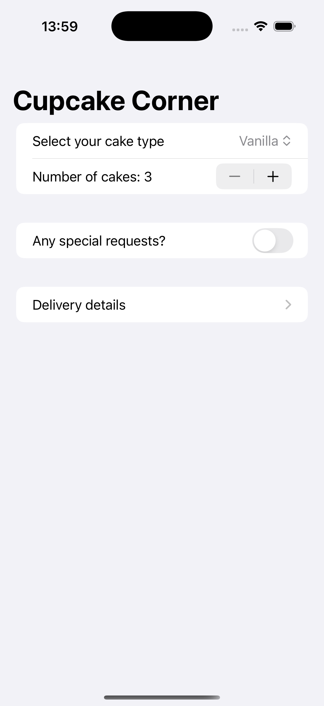

# Project7-CupcakeCorner - Online Cupcake Ordering

A SwiftUI e-commerce application for ordering custom cupcakes online. Features order customization, delivery details, and network integration for a complete online shopping experience.

## Screenshots

    
    
    

## Features

- **Cupcake Selection**: Choose from multiple cupcake types
- **Quantity Selection**: Order 3-20 cupcakes per order
- **Special Requests**: Add extra frosting and sprinkles
- **Delivery Details**: Complete address and contact information
- **Order Management**: Track and manage cupcake orders
- **Network Integration**: Submit orders to remote server
- **Form Validation**: Input validation for delivery details

## How It Works

1. **Select Cupcakes**: Choose your preferred cupcake type
2. **Set Quantity**: Select number of cupcakes (3-20)
3. **Add Extras**: Enable special requests for frosting and sprinkles
4. **Enter Details**: Provide delivery address and contact information
5. **Place Order**: Submit your order to the cupcake shop
6. **Track Order**: Monitor your order status

## Order Customization

- **Cupcake Types**: Multiple flavors and varieties
- **Quantity**: Flexible ordering from 3 to 20 cupcakes
- **Special Requests**: Extra frosting and sprinkles options
- **Delivery**: Complete address and contact information

## Technical Features

- **Network Requests**: URLSession for order submission
- **Form Validation**: Input validation and error handling
- **State Management**: Complex order state with multiple properties
- **Navigation**: Multi-step ordering process
- **JSON Encoding**: Order data serialization for API

## Technical Details

- **Platform**: iOS 17.0+
- **Language**: Swift
- **Framework**: SwiftUI
- **Architecture**: MVVM with network integration
- **Key Concepts**: URLSession, JSON encoding, form validation, navigation
- **Target**: iPhone (Portrait orientation)

## Setup Instructions

1. Open `CupcakeCorner.xcodeproj` in Xcode
2. Select your target device or simulator
3. Build and run the project (⌘+R)
4. Start ordering cupcakes!

## Requirements

- Xcode 15.0 or later
- iOS 17.0 or later
- Swift 5.9 or later
- Internet connection for order submission

## About

This project is part of the "100 Days of SwiftUI" challenge. It demonstrates:

- **E-commerce Design**: Online ordering system architecture
- **Network Programming**: URLSession and API integration
- **Form Handling**: Complex multi-step forms with validation
- **State Management**: Managing complex order state
- **JSON Processing**: Encoding data for network transmission
- **User Experience**: Intuitive ordering flow design

## Author

Created by Ahmet Büyükçelik as part of 100 Days of SwiftUI learning journey.

---

*Order delicious cupcakes with ease! 🧁🛒*
