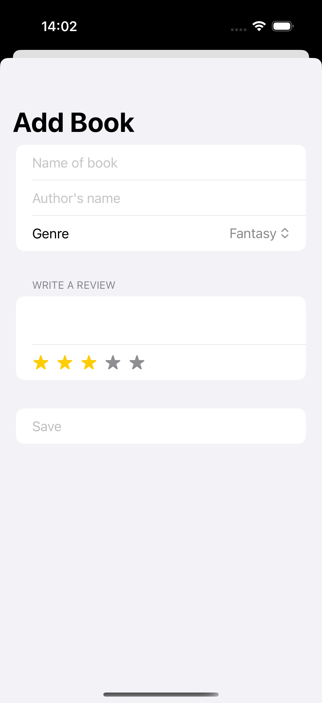
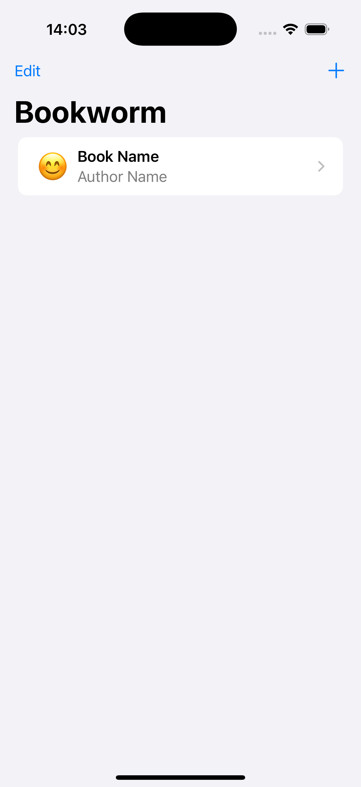
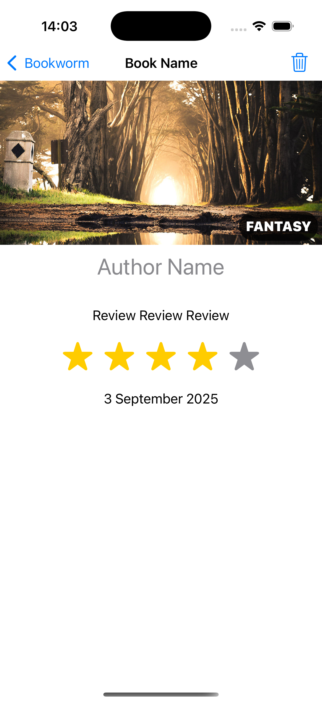

# Project8-Bookworm - Personal Library Manager

A SwiftUI book tracking application with SwiftData integration. Features book management, rating system, and detailed book information for organizing your personal library collection.

## Screenshots

    
    
    

## Features

- **Book Management**: Add, view, and delete books from your library
- **Rating System**: Rate books with emoji-based star ratings
- **Book Details**: Comprehensive book information including title, author, and review
- **Persistent Storage**: SwiftData integration for data persistence
- **Visual Indicators**: Color-coded ratings and poor rating warnings
- **Search & Sort**: Organized book listing with sorting capabilities
- **Edit Mode**: Easy book deletion with edit functionality

## How It Works

1. **View Library**: Browse all your books with ratings and details
2. **Add Books**: Tap + to add new books to your collection
3. **Rate Books**: Use emoji ratings to rate your books
4. **View Details**: Tap any book to see detailed information
5. **Manage Books**: Edit mode for deleting unwanted books
6. **Track Progress**: Monitor your reading collection

## Rating System

- **5 Stars**: ⭐⭐⭐⭐⭐ Excellent
- **4 Stars**: ⭐⭐⭐⭐ Very Good
- **3 Stars**: ⭐⭐⭐ Good
- **2 Stars**: ⭐⭐ Fair
- **1 Star**: ⭐ Poor (shown in red)

## Technical Features

- **SwiftData Integration**: @Model classes for data persistence
- **Navigation**: NavigationDestination for book details
- **Sorting**: Multiple sort descriptors for organized listing
- **Visual Feedback**: Color-coded ratings and warnings
- **Sheet Presentations**: Modal forms for adding books

## Technical Details

- **Platform**: iOS 17.0+
- **Language**: Swift
- **Framework**: SwiftUI + SwiftData
- **Architecture**: MVVM with data persistence
- **Key Concepts**: @Model, @Query, SortDescriptor, navigation, sheets
- **Target**: iPhone (Portrait orientation)

## Setup Instructions

1. Open `Bookworm.xcodeproj` in Xcode
2. Select your target device or simulator
3. Build and run the project (⌘+R)
4. Start building your library!

## Requirements

- Xcode 15.0 or later
- iOS 17.0 or later
- Swift 5.9 or later

## About

This project is part of the "100 Days of SwiftUI" challenge. It demonstrates:

- **SwiftData Integration**: @Model classes and data persistence
- **Complex Sorting**: Multiple SortDescriptor usage
- **Navigation Patterns**: NavigationDestination and deep linking
- **Data Management**: CRUD operations with SwiftData
- **Visual Design**: Emoji ratings and color-coded feedback
- **Library Management**: Personal collection organization

## Author

Created by Ahmet Büyükçelik as part of 100 Days of SwiftUI learning journey.

---

*Organize your reading journey! 📚⭐*
